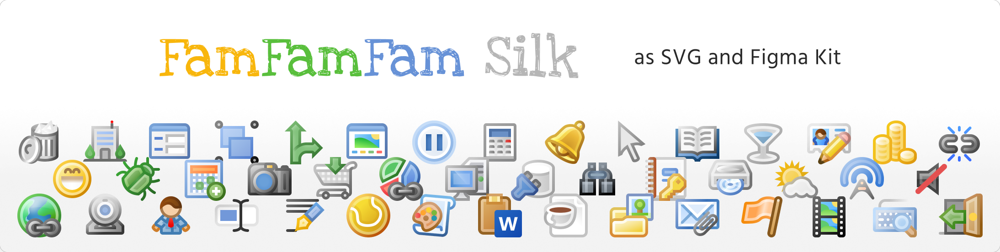

# FamFamFam Silk as SVG
> The iconic iconset of the 2010’s era from Marc James, remade in SVG and Figma kit for today’s needs.

## 🚀 Getting started

This work contains icons in SVG ready to use as you need it. Feel free to: 

* Clone or fork the repository.
* Use the [Figma UI Kit](https://)!
* Or simply download files from the [icons](./icons/) folder.

### Mix and Match icons to create new ones.

(this section is for v2)
You may not find the perfect match from the 1000 icons here, so here come the [decorators](./decorators/) and [parts](./parts/) folders.

- Decorators are bullet-like icons that you can place above an existing icon to give it more meaning.
  `image of a composition`
- Some icons have parts available to allow you to customize or change element of an icon to your need.
   `image of parts and variations arout them (using the user icon as example)`

## Contribute 🧑‍🎨 

Contributions are welcomed to this project! Want to contribute?, pick the righ section below:

**🖐️ I would like to report a bug or an issue!**  
The issue section is the right place for you to describe your problem. Please take time to review existing issue to avoir duplicates.

**🩹 I have fixed this icon, how can I give it back?**  
*Fork* → *Patch* → *Push*  → *Pull Request*. Please read the Contribution guideline or your contribution may not be approved.

**🪄 Can I create an icon too?**  
Sure! Take note of the Contribution guideline and *Fork* → *Create* → *Push*  → *Pull Request*.

## License

I have not settled on the right licence for this product, so as for now I'll follow Mark James' Create Commons Attribution. He used 2.5, but I picked version 4.
I would like a more protective licence, one that could permit company and users to pick stuff here and use them in commercial products and marketing material, but prevent "stealing" stuff or changing ownership over minimal visual changes.