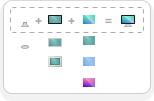

  
# FamFamFam Silk as SVG & Figma Kit

> The iconic iconset of the 2010’s era from Mark James, remade in SVG and Figma kit for today’s needs.

## 🚀 Getting started

### Get the icons

This work contains 1000+ icons in SVG ready to use as you need it. Feel free to 

* Clone or fork the repository
* Use the [Figma UI Kit](https://)!
* Or simply download files from the [icons](./icons/) folder

### Mix and Match icons to create new ones

You may not find the perfect icon, so [decorators](./decorators/), [parts](./parts/) and [variants](/variants) (in their respective folders) come to help.

- Decorators are bullet-like icons that you can place on top of an existing icon to give it more meaning  
  
- Some icons have parts to allow you to customize or change element to your need  
  
- Variants contains slight aestetics changes of an icon  
  

## Contribute 🧑‍🎨

Contributions are welcomed to this project! Want to contribute?, pick the righ section below:

**🖐️ I would like to report a bug or suggest something!**  
The issue section is the right place for you to describe your problem. Please take time to review existing issues to avoid duplicates, and read the [Contribution guidelines](./CONTRIBUTION.md#-issues).

**🩹 I have fixed this icon, how can I give it back?**  
*Fork* → *Patch* → *Push*  → *Pull Request*. Please read the [Contribution guideline](./CONTRIBUTION.md#-code-contributions) or your contribution may not be approved.

**🪄 Can I create an icon too?**  
Sure! Take note of the [Contribution guideline](./CONTRIBUTION.md#-code-contributions) and *Fork* → *Create* → *Push*  → *Pull Request*.

## License

This project is licensed under the [**Creative Commons BY 4**](https://creativecommons.org/licenses/by/4.0/) license. In a nutshell,

### You are free to
- **Share** — copy and redistribute the material in any medium or format for any purpose, even commercially.
- **Adapt** — remix, transform, and build upon the material for any purpose, even commercially.
- The licensor cannot revoke these freedoms as long as you follow the license terms.

### Under the following terms
- **Attribution** — You must give [appropriate credit](https://creativecommons.org/licenses/by/4.0/#ref-appropriate-credit), provide a link to the [license](./LICENSE), and [indicate if changes were made](https://creativecommons.org/licenses/by/4.0/#ref-indicate-changes). You may do so in any reasonable manner, but not in any way that suggests the licensor endorses you or your use.
- **No additional restrictions** — You may not apply legal terms or [technological measures](https://creativecommons.org/licenses/by/4.0/#ref-technological-measures) that legally restrict others from doing anything the license permits.

### Notices
You do not have to comply with the license for elements of the material in the public domain or where your use is permitted by an applicable [exception or limitation](https://creativecommons.org/licenses/by/4.0/#ref-exception-or-limitation).

No warranties are given. The license may not give you all of the permissions necessary for your intended use. For example, other rights such as [publicity, privacy, or moral rights](https://creativecommons.org/licenses/by/4.0/#ref-publicity-privacy-or-moral-rights) may limit how you use the material. 

## Acknowlegements

### Credits

 - © Mark James
 - © Simon Priet
 - Members of the Contributors section

The Original *FamFamFam Silk* icon pack ([github](https://github.com/markjames/famfamfam-silk-icons) • [website](http://www.famfamfam.com/lab/icons/silk/)) remains the property of Mark James. Please have my thanks and salute for your great work.

### Fonts
- [Fira Mono](https://github.com/mozilla/Fira)
- [Fira Sans](https://github.com/mozilla/Fira)
- [Fira Sans Condensed](https://github.com/mozilla/Fira)
- [Love Ya Like a Sister](https://fonts.google.com/specimen/Love+Ya+Like+A+Sister) by [Kimberly Geswein](https://kimberlygeswein.com/)
- [Segoe UI](https://learn.microsoft.com/en-us/typography/font-list/segoe-ui) (for Office logos)
- [Hind](https://fonts.google.com/specimen/Hind) by the [Indian Type Foundry](https://www.indiantypefoundry.com/)

### Softwares
- [Gitea](https://about.gitea.com/), an awesome self-hosted github alternative
- [Figma](https://www.figma.com)
- [Firefox](https://www.mozilla.org/firefox/new/)
- [VSCodium](https://vscodium.com/), a community-driven, freely-licensed binary distribution of Microsoft’s editor VS Code

### About me

Hi I'm Simon. Computer enthousiast, I have recently switch to become a Product.UX.UI Designer, and used to be a Quality Engineer. I love to create stuff and make them available to all • 
[linkedin](https://www.linkedin.com/in/simonpriet/) • [behance](https://www.behance.net/SimonPistache#) • [dribbble](https://dribbble.com/SimonPistache) • [github](https://github.com/SimonPistache)