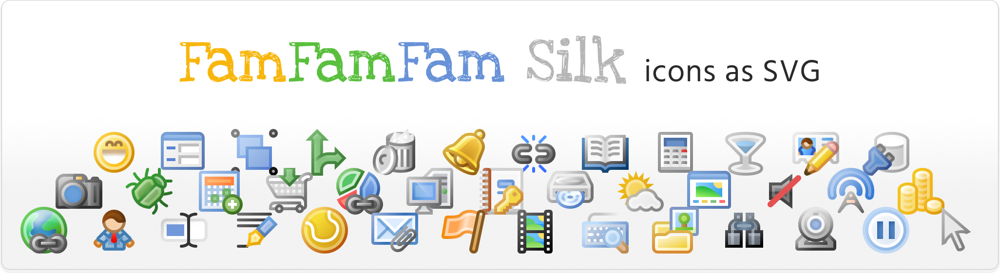
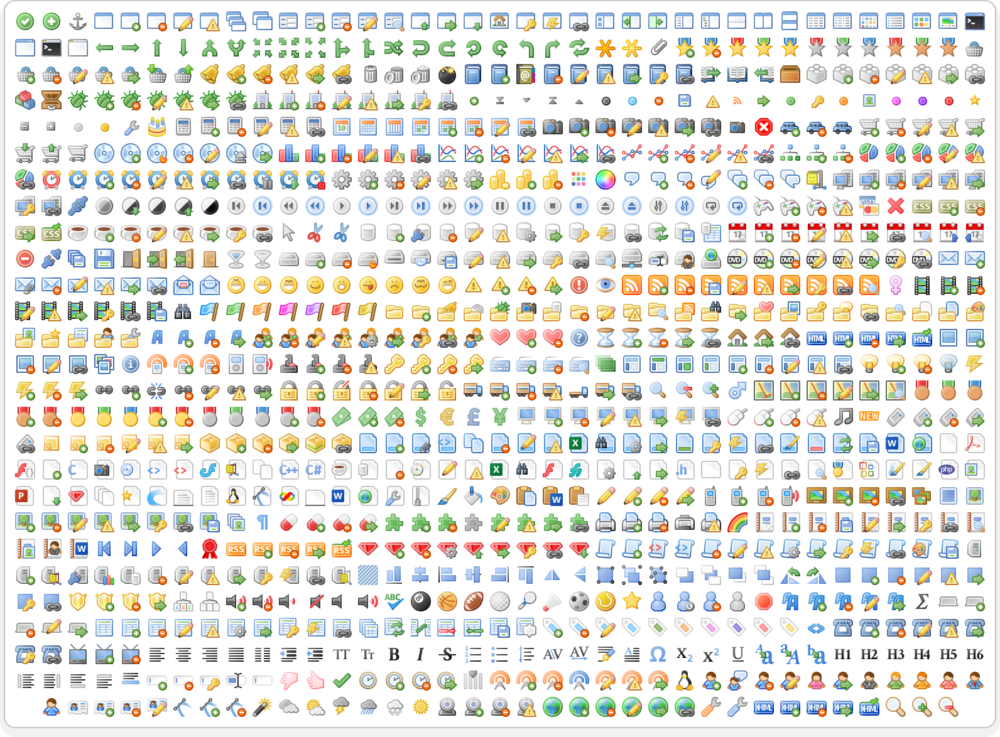

# FamFamFam Silk as SVG
> The iconic iconset of the 2010’s era from Mark James, remade in SVG for today’s needs.

This project contains ~1000 icons in SVG. SVG is lightweight, scalable compared to PNG — and open format, allowing anyone to edit it to his/her needs. I aim to have all the original icons remastered, but also create more up-to-date versions (Smartphones was not a thing back in 2008). Plus, most icons can be mixed with decorators (bullets) to get more meaning. 

Scale:     

Mix:  +  = 

Customize:    

## How to use 

* Clone or fork the repository.
* Download files from the [icons](./icons/) folder.

  

###  Roadmap

* (Soon) Designers: Get the Figma UI Kit
* (Soon) Access to more decorators
* (Soon) Access to variants
* (Soon) Access to parts

## Contributing 

Reports, Requests and Contributions are welcomed to this project! I believe that healthy debate and disagreement are essential to a healthy project and community. However, it is never ok to be disrespectful.

###   I would like to report a bug or suggest something!

The issue section is the right place for you to describe your problem. Specific rules applies, and not following them may result in the closing of the issue.
* Issue must have a label related to your topic
* Issue must be sufficiently described, clear and not misleading
* Issue may be flagged as _duplicate_ if the topic is already discussed on another issue.
* There is no garanties that an Issue will be resolved. I have limited bandwidth.

###   Can I create an icon too?

Sure! Please *Fork* → *Create* → *Push* → *Pull Request*, follow the [Pull Request & commits guidelines](#pull-request-and-commit-guidelines), and the [Icon Design guidelines](#icon-design-guidelines) below.

###   I have fixed this icon, how can I give it back?

Thank you! Please *Fork* → *Patch* → *Push* → *Pull Request* and follow the [Pull Request & commits guidelines](#pull-request-and-commit-guidelines), and the [Icon Design guidelines](#icon-design-guidelines) below.

### Pull Request and Commit Guidelines
- It should stick to the [community's best practices](https://github.com/kubernetes/community/blob/master/contributors/guide/pull-requests.md#best-practices-for-faster-reviews) as close as possible
- It must follow the [Conventional Commits](https://www.conventionalcommits.org/en/v1.0.0/#summary) principles in commit and PR names.
- It must be related to an issue in this project.
- Authors of contribution are credited (via the Contributor section of Github)

### Icon Design Guidelines
- Icons must be in the **style and spirit of the original work** from Mark James.
- Icons must be in **SVG**.
- Icons must be designed to be **legible in any size from 16×16px to 64×64px**. It must have the right balance between too much details and too little. I recommand using a grid of 16×16 to help.
- Icon improvement based on existing icons must be as close as possible to the original design, especially at 16×16px.
- Icon must render without visual artefact in today's broswer such as WebKit, Blink, Gecko. (Test your icons)

## License 

This project is licensed under the [**Creative Commons BY 4**](https://creativecommons.org/licenses/by/4.0/) license. This content is distributed in the hope that it will be useful, but **without any warranty**; without even the implied warranty of **merchantability** or **fitness for a particular purpose**.

## Acknowlegements 

The Original *FamFamFam Silk* icon pack ([github](https://github.com/markjames/famfamfam-silk-icons) • [website](http://www.famfamfam.com/lab/icons/silk/)) remains the property of Mark James. Mark, please have my thanks and salute for your great work.

#### Fonts
- [Fira Mono](https://github.com/mozilla/Fira)
- [Fira Sans](https://github.com/mozilla/Fira)
- [Fira Sans Condensed](https://github.com/mozilla/Fira)
- [Love Ya Like a Sister](https://fonts.google.com/specimen/Love+Ya+Like+A+Sister) by [Kimberly Geswein](https://kimberlygeswein.com/)
- [Segoe UI](https://learn.microsoft.com/en-us/typography/font-list/segoe-ui) (for Office logos)
- [Hind](https://fonts.google.com/specimen/Hind) by the [Indian Type Foundry](https://www.indiantypefoundry.com/)

#### Softwares
- [Figma](https://www.figma.com) as the SVG design software
- [Firefox](https://www.mozilla.org/firefox/new/)
- [Gitea](https://about.gitea.com/), an awesome self-hosted github alternative
- [VSCodium](https://vscodium.com/), a community-driven, freely-licensed binary distribution of Microsoft’s editor VS Code

#### About me

Hi I'm Simon. Computer enthousiast, I have recently switch to become a Product.UX.UI Designer, and used to be a Quality Engineer. I love to create stuff and share it. 
[linkedin](https://www.linkedin.com/in/simonpriet/) • [behance](https://www.behance.net/SimonPistache#) • [dribbble](https://dribbble.com/SimonPistache) • [github](https://github.com/SimonPistache)